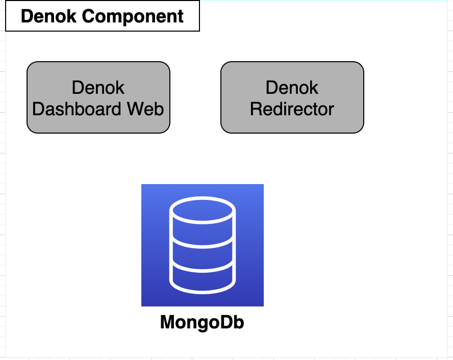
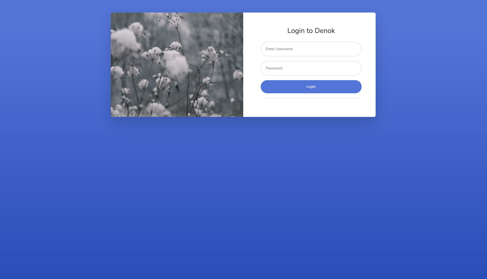
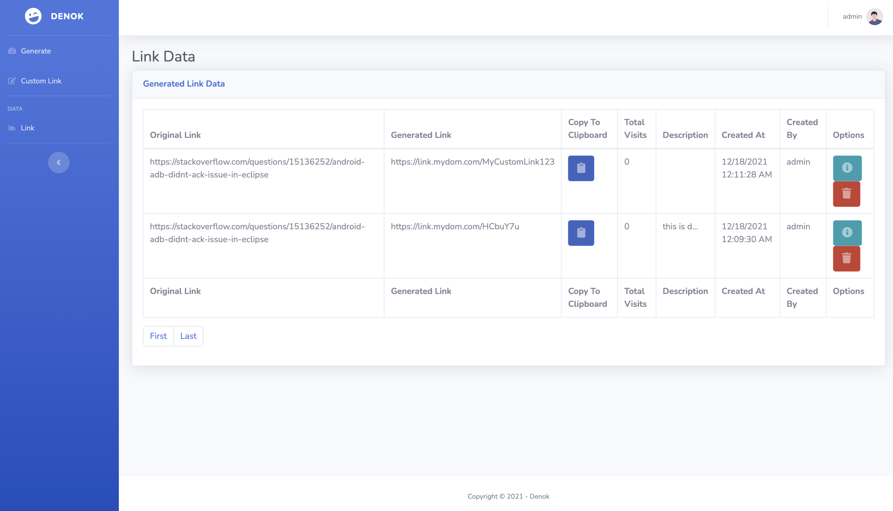

# Denok

A self hosted Link Shortener built with `Dotnet (C#)` and `Rust`, as an alternative to services like `bitly`.

[](https://github.com/wuriyanto48)
<br/><br/>

### Requirements
- Dotnet https://dotnet.microsoft.com/en-us/download
- Rust (`rustc` version 1.50+) https://www.rust-lang.org/tools/install
- Docker and `docker-compose` https://www.docker.com/community/open-source

### Preparation
You need at least three domains, or three sub domains to run the two `Denok` components.
First domain for `Web Dashboard`, second domain for `Redirector`, 
third domain to catch error when `Redirector` cannot find unique URL code in database. 

Two domain must be in the `environment variable`. Open the `.env.development` file, and adjust with yours.

For example:
```
DOMAIN_NAME=https://link.mydom.com
DOMAIN_NOT_FOUND=http://help.mydom.com
```

### Build
For build and run, simply `run`
```shell
$ docker-compose up -d
```

### Login Admin
```
username: user
password: 12345
```

### Inspect
Two Denok component will run in the different processes, `Web Dashboard` will run on port `9010` 
and `Redirector` will run on port `9011`.

Or inspect the docker processes with `docker ps`
```shell
$ docker ps
CONTAINER ID   IMAGE            COMMAND                  CREATED       STATUS       PORTS                                           NAMES
408c91f47ac3   denok_denokred   "dotnet Denok.Redire…"   9 hours ago   Up 9 hours   0.0.0.0:9011->9011/tcp, :::9011->9011/tcp       denok_denokred_1
0420e28aa208   denok_denokweb   "dotnet Denok.Web.dll"   9 hours ago   Up 9 hours   0.0.0.0:9010->9010/tcp, :::9010->9010/tcp       denok_denokweb_1
43122edce5ae   mongo            "docker-entrypoint.s…"   9 hours ago   Up 9 hours   0.0.0.0:27017->27017/tcp, :::27017->27017/tcp   mongodb
```

### Expose to the internet
Both `Web Dashboard` and `Redirector` will run on non standard `port`, so you need to use `reverse proxy` server like `nginx`.

Open the `nginx` folder.

### QR Code Logo
If you want to use your own `QR Code logo`, first convert your image file logo to `base64` text format, and then copy and replace it into the `QR_LOGO` env variable from the  `.env.development` file

### Screenshot
[](https://github.com/wuriyanto48)
[](https://github.com/wuriyanto48)
[](https://github.com/wuriyanto48)
[](https://github.com/wuriyanto48)
[](https://github.com/wuriyanto48)

### Bootstrap template
https://github.com/startbootstrap/startbootstrap-sb-admin-2